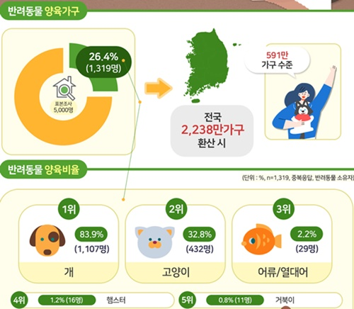

# Walkie Doggie

## 프로젝트 기획 의도

---



- 반려동물 양육가구는 늘어가는 추세
- 그 중 제일 많은 수를 차지하는 강아지를 위한, 강아지 입장에서 쓸 수 있는 서비스를 만들고자 함
- 산책의 중요성
    - 스트레스 해소
    - 사회성 기르기
    - 건강 유지 및 체력 기르기
    - 주인과의 유대관계 형성

## 프로젝트 소개

---

- **진행 기간** : 2021. 04. 12 ~ 2021. 05. 28
- **Daily Scrum :** 매일 오전 오후 30분
- **프로젝트 설명**

    강아지들과 견주들을 위한 위치기반 종합 서비스

    **일기장, 산책, 성분분석 등**

## 실행방법

---

```bash
frontend/final
> npm install
> npm run serve

backend
> ./mvnw spring-boot:run
```


## 폴더 구조

---

### 📦backend


### 📦frontend


## 시스템 아키텍처

---


## ERD

---


## 와이어프레임

---

### 1. 로그인/ 회원가입 UI


### 2. 일기 UI


### 3. 산책 UI


### 4. 성분 분석 UI


### 5. 마이페이지 UI


### 6. 건강/ 통계 UI


## 주요 기능 설명 및 실제 화면

---

### 🌈 **기록일지**

- 강아지별 일기 작성
- 산책기록 확인


### 🛴 **산책**

- 실시간 산책 경로 표시 및 현재 위치 좋아요 후 사진 업로드
- 다른 사람들의 게시글도 지도에서 위치와 함께 확인 가능


### ⚡**성분분석**

- 사료, 간식 등의 성분표 사진을 OCR을 사용해 분석
- 강아지가 가지고 있는 알러지와 매치시켜 보여줌
- 유해성분 포함여부와 설명


### 👶 마이페이지

- 최대 세마리 반려견 등록가능
- 일기에서 기록한 날짜별 건강사항 확인
- 나와 지역내 평균 산책 데이터 차트로 확인


## 팀원 소개

